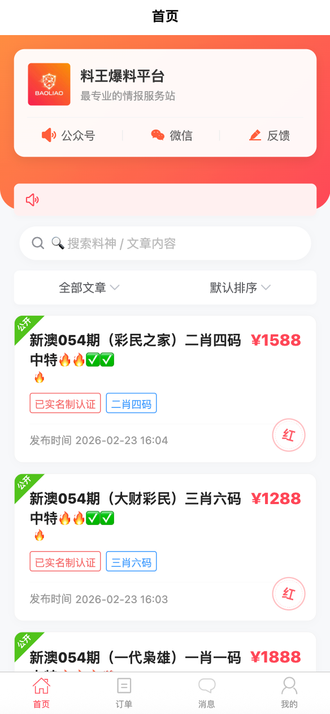
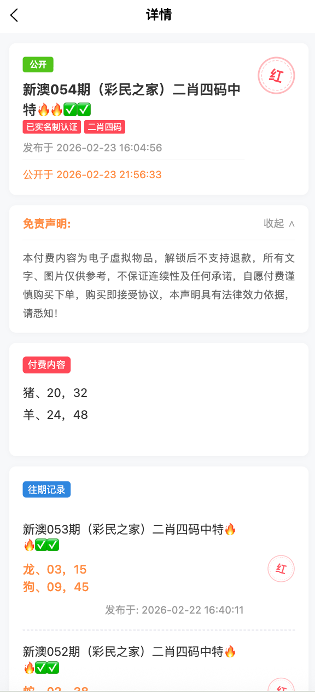
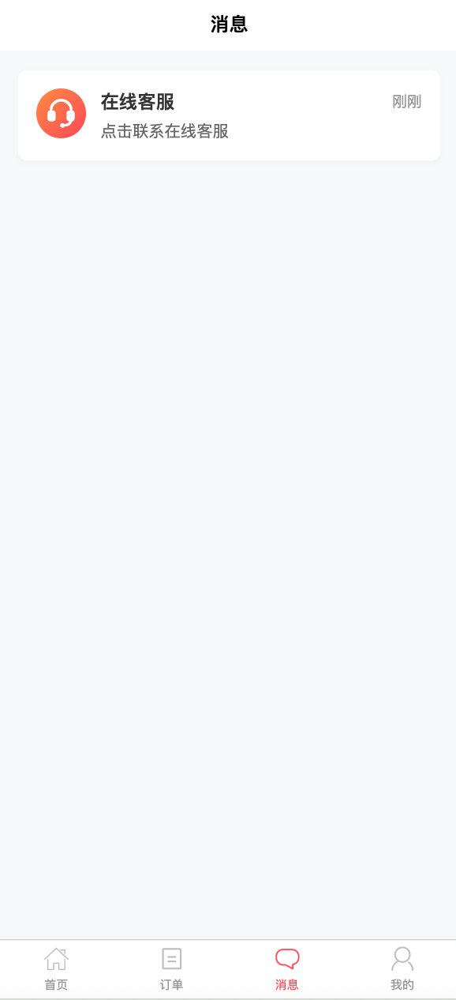
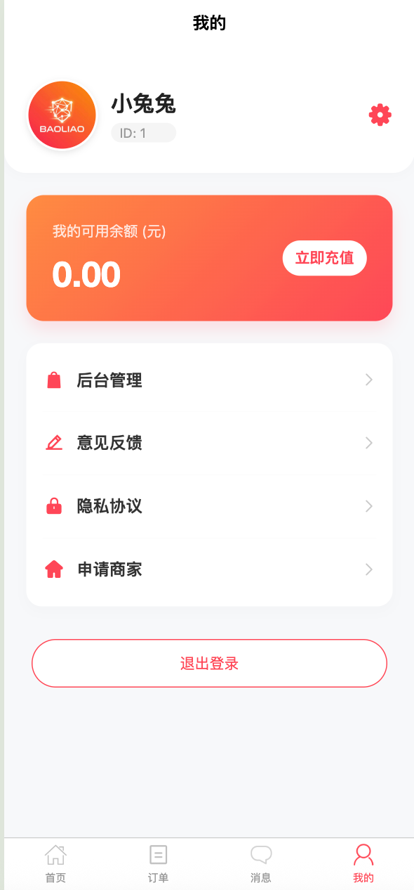
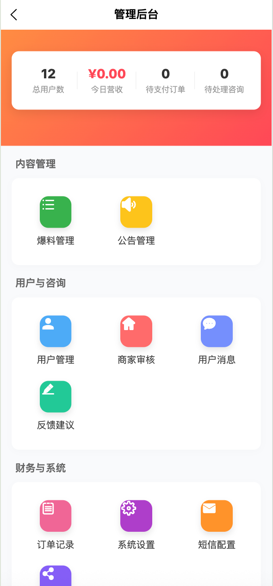
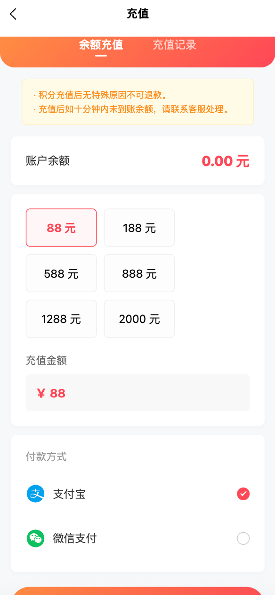
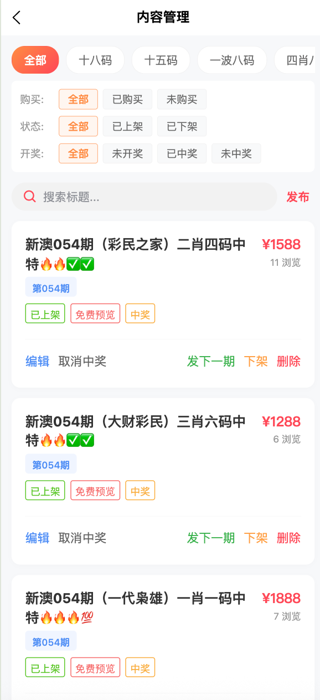
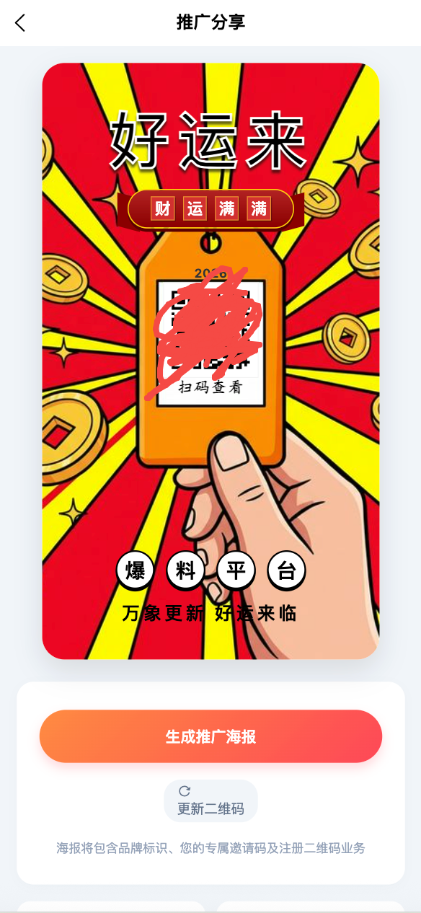

# 爆料/吃瓜/资讯聚合系统 - 纯前端部分源码公开版

## 📖 项目简介
本项目是一款专门为**吃瓜、爆料、同城新闻、娱乐资讯**聚合打造的高级移动端界面项目（基于 Uni-App 开发）。能够一键编译发布到微信小程序、H5、Android 和 iOS 原生应用。拥有极为流畅的滑动交互与精致的UI视觉体验。

本项目为**自媒体大V、同城爆料平台、校园墙、表白墙、娱乐八卦社区**等垂直领域量身定制，涵盖资讯信息流、图文混排、用户评论互动、话题讨论等常见社区核心组件UI。

🔍 **强力搜索关键词 (SEO Keywords)**：
爆料吃瓜源码、同城爆料小程序、吃瓜APP前端源码、黑料不打烊、自建聚合新闻系统、资讯APP源码下载、娱乐八卦吃瓜群、uni-app交友论坛系统、自带爬虫系统前端、前端页面一键部署、毕业设计源码、二开接单、社区交友源码免费下载。

---

## 📸 运行截图
*(以下为部分页面的实时运行截图)*

---

## 🔒 源码获取与开发展示
由于本项目完整版包含了**自带的高级爬虫系统引擎、后端管理系统以及全部核心API**，因此当前仓库仅开源了**部分前端UI代码与静态页面结构**，供各位前端工程师学习参考项目架构与页面样式。核心业务逻辑代码及完整版资源未向公众全开源。

### 💬 遇到代码不懂？需要完整版？
如果在学习、二开过程中遇到困难，或者您想直接获取**包含后端、爬虫和前端的完整商业版无加密源码**：
📢 **请联系作者 飞机 (Telegram): `mayikaiyuan`**
🔗 直达链接: [https://t.me/mayikaiyuan](https://t.me/mayikaiyuan) 

---

## ⚠️ 免责声明 (Disclaimer) ⚠️

**本仓库所发布的所有代码、截图、文档等资源，其唯一目的是为了提供前端 UI 设计的思想交流与学习参考。**

1. 任何人或组织在下载、复制或使用本仓库部分源码时，**必须完全自己承担一切风险**。
2. 无论因使用、修改或分发本代码而产生任何**直接、间接、意外、特殊或附带的损失及法律纠纷**（包括但不限于数据丢失、业务中断、违规违法问题），**原作者概不负责。**
3. 严禁任何人将本项目代码及相关资源用于**任何形式的非法用途**（包括但不限于色情、涉赌、暴力、侵权、非法抓取数据等）。如使用者将其用于非法用途，视为使用者自身行为，所产生的一切法律后果由使用者本人完全独立承担，与本仓库及原作者**绝无任何连带责任**。

**当您克隆、下载或者部分参考本项目代码的那一刻起，即代表您已仔细阅读并完全自愿接受上述免责声明的全部条款！**
